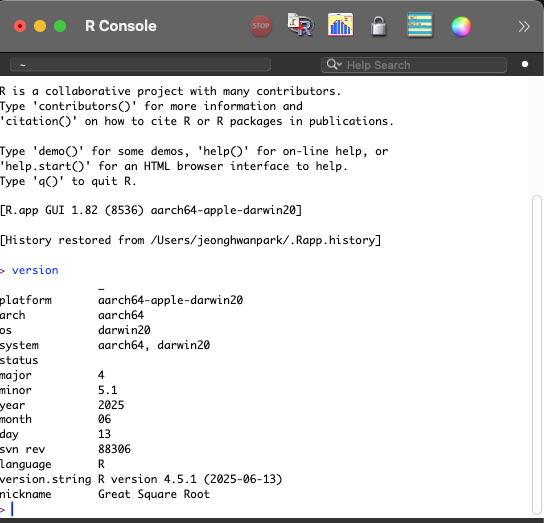
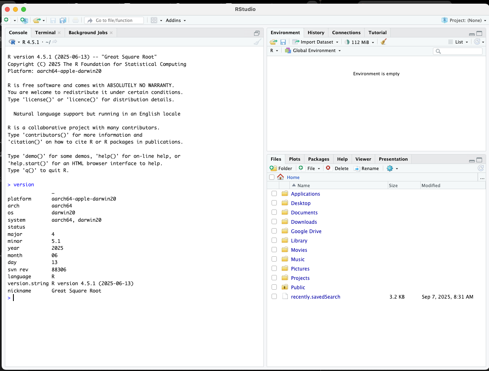

# R 언어의 기원과 특징

## 왜 R 언어를 배울까?

R언어를 배우는 이유는 간단합니다. **데이터 분석**에 필요하기 때문입니다. 현대 사회에서 데이터는 새로운 석유라고 불릴 만큼 중요하며, 이를 효과적으로 분석할 수 있는 도구가 필요합니다.

## 프로그래밍 언어의 알파벳 순서 미스터리

많은 사람들이 C언어는 알고 있지만, A언어나 B언어는 생소합니다. 왜 알파벳 순서대로 A, B를 건너뛰고 C언어가 널리 사용될까요?

**A언어(APL - A Programming Language)**

- 수학 전용 프로그래밍 언어
- 다양한 특수문자로 구성되어 학습이 매우 어려움
- 범용성이 떨어져 일반적으로 사용되지 않음

**B언어**

- C언어의 직접적인 전신
- 벨 연구소에서 개발
- C언어 개발의 토대가 되었지만 현재는 사용되지 않음

**C언어가 성공한 이유**

- 뛰어난 범용성과 효율성
- 시스템 프로그래밍부터 응용 프로그램까지 광범위한 활용
- 다른 언어들의 기반이 되는 언어

## 알파벳 프로그래밍 언어들의 존재

놀랍게도 알파벳을 따른 프로그래밍 언어들이 실제로 존재합니다:
**존재하는 언어들:** A, B, C, D, E, F, G, J, K, L, M, P, Q, R, S, T, U, V, X, Y, Z

이들 언어는 알파벳 순서에 따라 체계적으로 개발된 것이 아니라, 각각 다른 목적과 배경을 가지고 만들어졌습니다.

## R 언어의 탄생 스토리

### S 언어의 한계

R언어를 이해하려면 먼저 **S 언어**를 알아야 합니다.

- **개발:** 1976년 벨 연구소의 John Chambers
- **목적:** 통계 분석 (Statistics의 S)
- **한계:** 그래픽 데이터 시각화 기능이 부족

### R 언어의 개발 배경

1990년대 초, 뉴질랜드 오클랜드 대학교에서 두 연구자가 만났습니다:

**로스 이하카(Ross Ihaka)** - 통계학자
**로버트 젠틀맨(Robert Gentleman)** - 생물정보학자

이들은 **"학부생들도 쉽게 사용할 수 있는 데이터 분석 언어"**가 필요하다고 생각했습니다.

### 왜 이름이 R인가?

- 두 창시자의 이름이 모두 **R**로 시작
- S 언어의 후속작이라는 의미에서 알파벳상 다음 글자인 R 선택


## R 언어 설치하기

R 언어를 시작하려면 먼저 설치가 필요합니다. 운영체제별 설치 방법을 안내드리겠습니다.

### 윈도우(Windows) 설치

**1단계: R 다운로드**

1. [CRAN 공식 웹사이트](https://cran.r-project.org/) 접속
2. "Download R for Windows" 클릭
3. "base" 클릭
4. "Download R-x.x.x for Windows" (최신 버전) 다운로드

**2단계: 설치 진행**

1. 다운로드한 `.exe` 파일 실행
2. 설치 마법사 따라가기
    - 언어 선택 (한국어/English)
    - 라이선스 동의
    - 설치 경로 선택 (기본값 권장: `C:\Program Files\R\R-x.x.x`)
    - 구성 요소 선택 (기본값 권장)
3. 설치 완료 후 바탕화면에 R 아이콘 생성 확인

**3단계: RStudio 설치 (권장)**

1. [RStudio 다운로드 페이지](https://www.rstudio.com/products/rstudio/download/) 접속
2. "RStudio Desktop" 무료 버전 다운로드
3. 설치 프로그램 실행 및 설치 완료

### 맥(macOS) 설치

**1단계: R 다운로드**

1. [CRAN 공식 웹사이트](https://cran.r-project.org/) 접속
2. "Download R for macOS" 클릭
3. 본인의 맥 프로세서에 맞는 버전 선택:
    - **Apple Silicon (M1/M2/M3)**: "R-x.x.x-arm64.pkg"
    - **Intel Mac**: "R-x.x.x.pkg"

**2단계: 설치 진행**

1. 다운로드한 `.pkg` 파일 더블클릭
2. 설치 마법사 진행
    - 소개 → 계속
    - 라이선스 → 동의
    - 설치 위치 선택 (기본값 권장)
    - 관리자 암호 입력
3. 설치 완료

**3단계: RStudio 설치 (권장)**

1. [RStudio 다운로드 페이지](https://www.rstudio.com/products/rstudio/download/) 접속
2. "RStudio Desktop" 무료 버전 다운로드 (macOS 버전)
3. `.dmg` 파일 실행 후 Applications 폴더로 드래그

### 설치 확인 방법

**R 설치 확인:**

1. R 또는 RStudio 실행
2. 콘솔창에 다음 명령어 입력:

```
version
```

1. R 버전 정보가 출력되면 설치 성공
  
  
